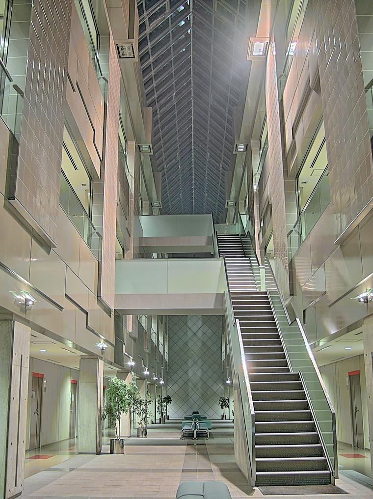
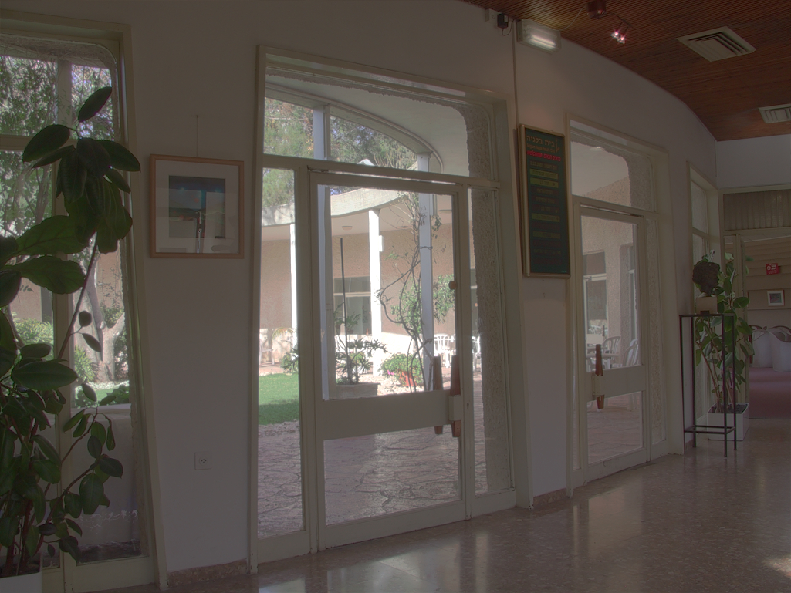
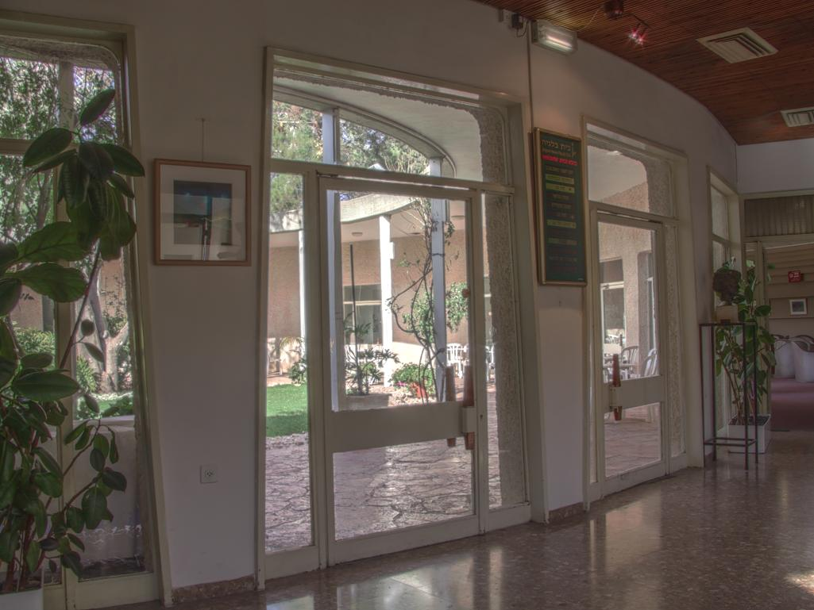
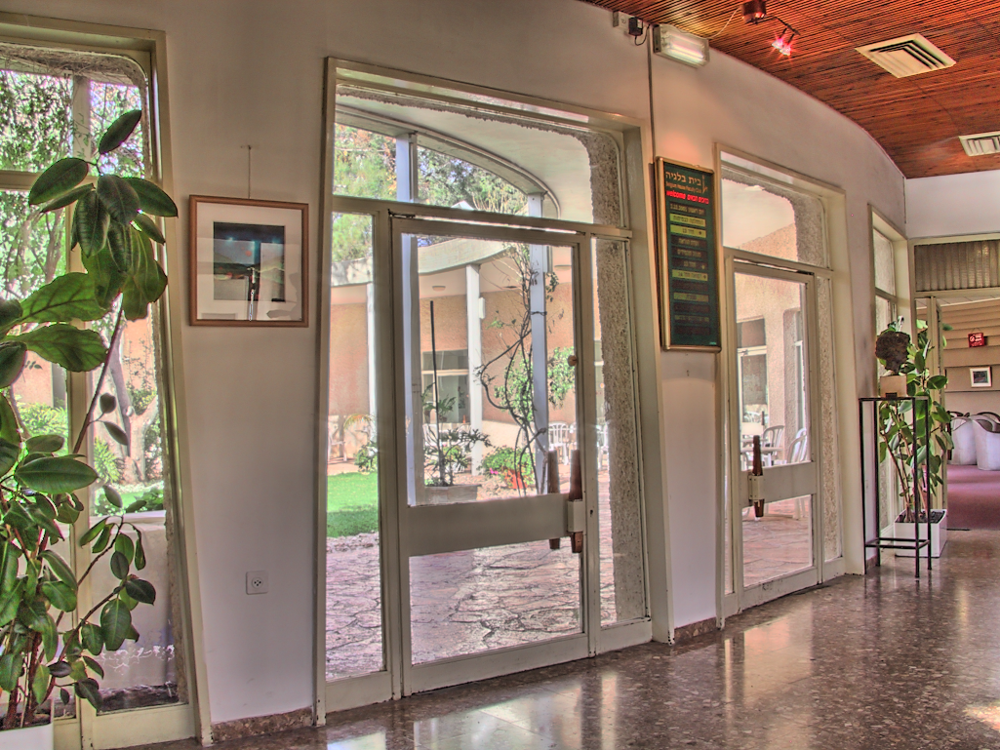
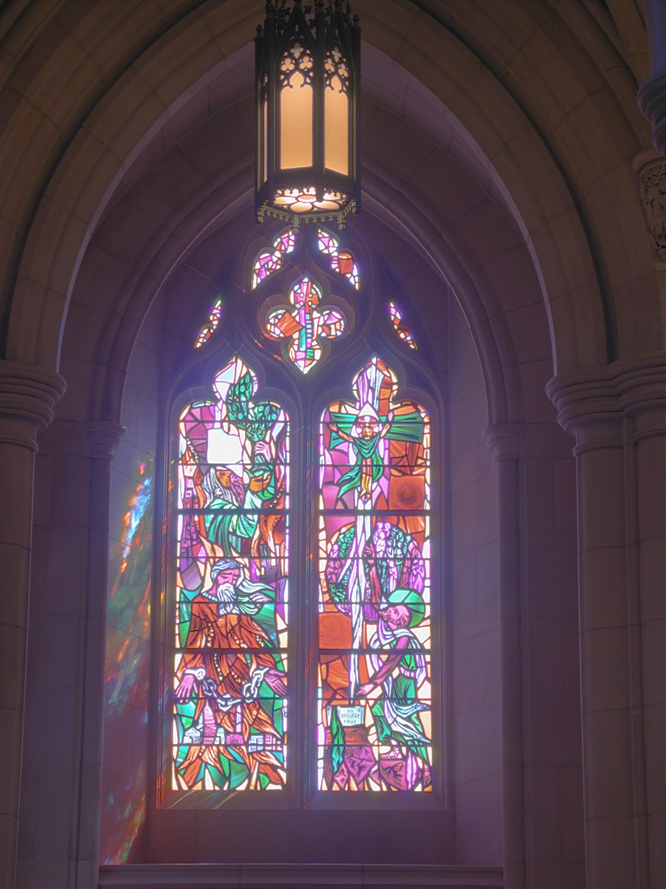

/

# Tone-Mapping-Based-on-Multi-scale-Histogram-Synthesis

|                           Durand                           |                         Gu                         |                          Paris                           |                   Ours                   |
| :--------------------------------------------------------: | :------------------------------------------------: | :------------------------------------------------------: | :--------------------------------------: |
|  |  |  |  |
|                        |                    |                       |        |
|                            |                        |                           |            |
|                          |                      |                         |          |

